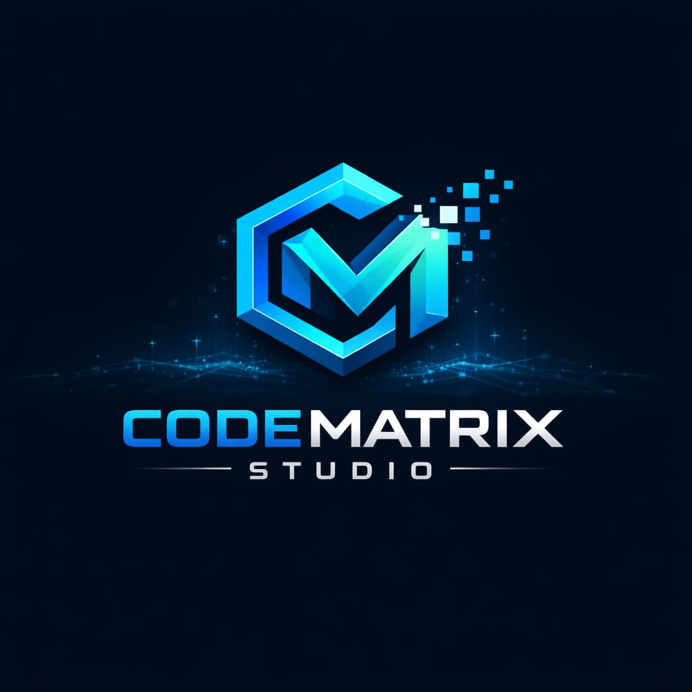

# CodeMatrix Studio

'Benchmarked for Brilliance'

---
Indie game and tech studio focused on building creative, high-performance browser and mobile games. We craft engaging gameplay experiences using modern web technologies, with a strong focus on clean code and smooth performance.

This repository represents more than just projects — it reflects ambition, experimentation, and continuous evolution. Every line of code here is written with intention, every design and decision carries thought, and every release pushes the standard a little higher.

I believe in building experiences, not just applications. Whether it’s a fast-paced browser game, a calm and immersive creative app, or a clean and responsive web interface, the goal remains the same: deliver something meaningful, smooth, and memorable. 

“Build with clarity. Design with purpose. Execute with precision.” 
That philosophy drives everything here.

This repository is a reflection of growth — learning new techniques, refining UI/UX, optimizing performance, and transforming ideas into polished digital products. I don’t follow trends blindly; I analyze, adapt, and improve.

“Small steps in code. Giant leaps in capability.”
Exploring this repository means stepping into a mindset where creativity and discipline work together. It’s about pushing limits, testing boundaries, and constantly asking, “How can this be better?” Because improvement is not optional — it’s a habit.

If you're here, you're not just viewing a profile. You're witnessing momentum in motion.

"Dream it. Design it. Develop it."

## 🚀 Featured Projects

### 🌌 Galaxy Jumper

Endless space runner game. 

🔗 Play: [https://jashbhai635.github.io/Galaxy-Jumper/]

This game is best experienced on itch.io

### 🔢 2048 GridX

Enhanced 2048 puzzle game with custom features. 

🔗 Play: [https://jashbhai635.github.io/2048-GridX/]

This game is best experienced on itch.io

### ❌⭕ Neon Grid

Advance tic-tac-toe game with ultimate and featured mode.

🔗 Play: [https://jashbhai635.github.io/Neon-Grid/]

This game is best experienced on itch.io

### 🖌️ Harmony Hues

Advanced colouring and painting app with Mandala engine.

🔗 Play: [https://jashbhai635.github.io/Harmony-Hues/]

This game is best experienced on itch.io

“Code is not just written here — it’s engineered.”

## 🎮 What We Build

- Browser & mobile-friendly games

- Indie and hyper-casual games

- Interactive web experiences

## 🛠 Tech Stack 

## 📍 Studio Info

- Studio: CodeMatrix Studio

- Location: Ahmedabad, India

---
Building games with passion, code, and creativity.

---
© 2026 CodeMatrix Studio. All rights reserved.

